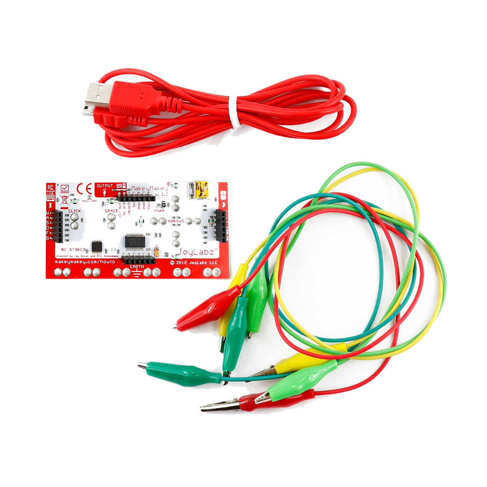

# Makey-Makey

## Beschreibung
Mit den Makey-Makey-Modulen lassen sich viele Alltagsgegenstände in Eingabegeräte verwandeln. Leitfähige Gegenstände wie Alufolie oder Früchte können einfach mit Krokodilklemmen an das Makey-Makey-Modul angeschlossen werden. Ist man zusätzlich selbst ebenfalls mit dem Makey-Makey verbunden, erkennt das Modul eine Berührung der leitfähigen Gegenstände. Das Makey-Makey wird schließlich mit USB an einen PC angeschlossen und damit können simple Spiele oder Anwendungen gesteuert werden.

Dadurch lassen sich beispielsweise Früchte oder auch Treppenstufen zu Klaviertasten verwandeln.

Alle weiteren Hintergrundinformationen sowie ein Beispielaufbau und alle notwendigen Programmbibliotheken sind auf der offiziellen Produktseite von Makey Makey zusammengefasst. Zusätzlich findet man über alle gängigen Suchmaschinen meist nur mit der Eingabe der genauen Komponenten-Bezeichnungen entsprechende Projektbeispiele und Tutorials.

<!-- infolist -->
## Wichtige Links für die ersten Schritte:

- [Makey-Makey Produktseite](https://www.makeymakey.com/)

